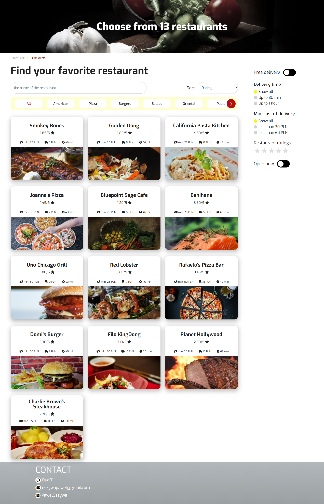
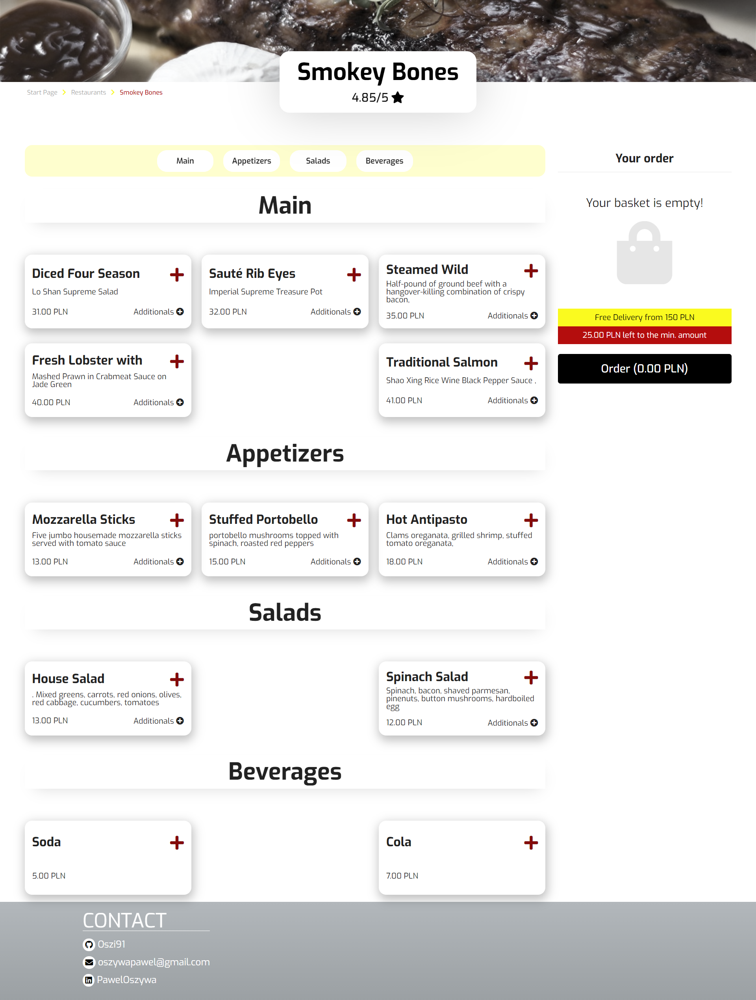
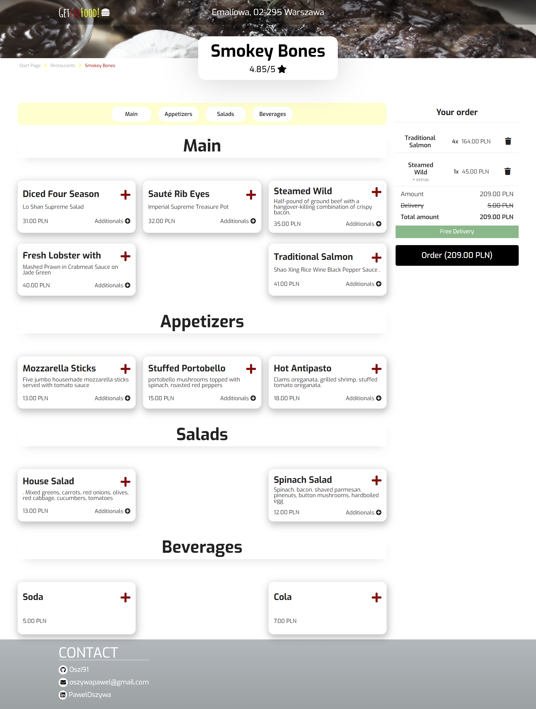
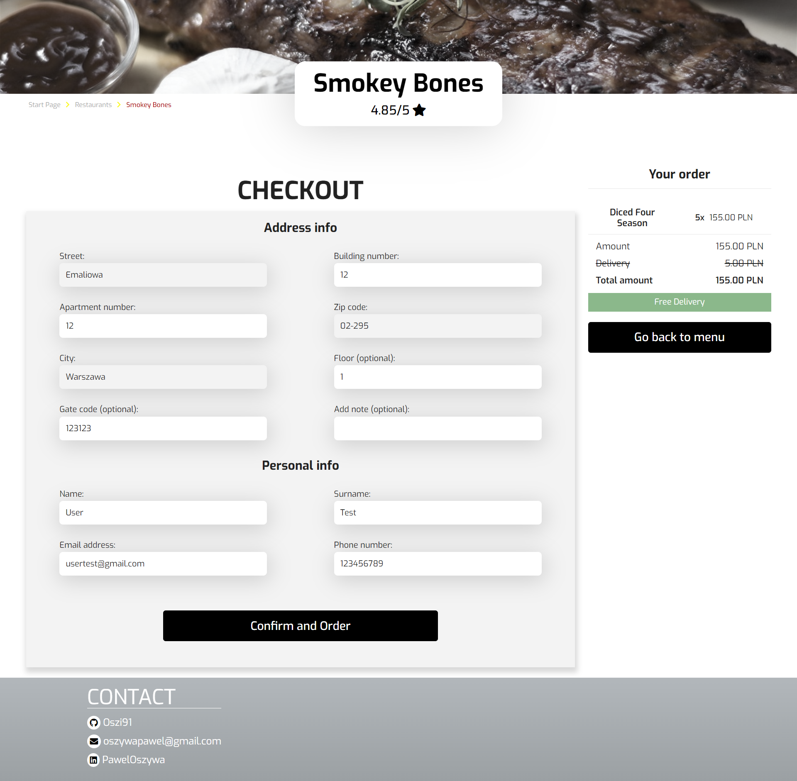
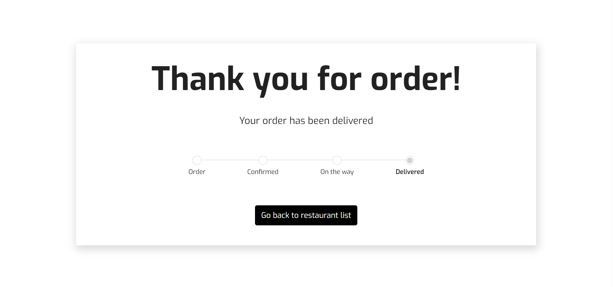

# GetTheFood - Live Demo
[GetTheFood - Live Demo](https://oszi91.github.io/GetTheFood)

## Description:
First, type in your address (there are only a few examples listed, such as Emaliowa) - when you start typing, a hint will appear. Then search for your favorite restaurant using the search engine / food type. You can also sort them by the filters of your choice. Also check for example if the delivery is free, if the time is under an hour, what is the rating of the restaurant. Once you have selected a restaurant, choose the appropriate dish and optional side dishes. Once you have reached the minimum order amount, you can proceed further. Fill in your order details - all fields are mandatory except for those marked 'optional'. Once you have filled out the form correctly, you can proceed to simulate the order process. Enjoy your meal. 

## GetTheFood - Preview






## Technologies:
| Tool | Description |
| :-------------:|--------------|
| HTML5 | A markup language used for structuring, and presenting content on the World Wide Web. |
| SASS | 	A preprocessor scripting language that is interpreted or compiled into CSS. |
| React | JavaScript library for creating user interfaces. |
| React Router Dom | DOM bindings for React Router. |
| React Multi Carousel | Supports multiple items slider. |
| Webpack | Packs CommonJs/AMD modules for the browser. Allows to split your codebase into multiple bundles, which can be loaded on demand. |

## Installation:

-  ```git clone https://github.com/oszi91/GetTheFood``` to clone the repository.
-  npm install to install all dependencies
-  npm start and http://localhost:3001/ in the browser to preview the app